# 📋 System Requirements Specification - FoodLab

## Содержание
1. [Введение](#intro)  
   1.1 [Назначение](#appointment)  
   1.2 [Бизнес-требования](#business_requirements)  
   1.3 [Аналоги](#analogues)  
2. [Требования пользователя](#user_requirements)  
   2.1 [Программные интерфейсы](#software_interfaces)  
   2.2 [Интерфейс пользователя](#user_interface)  
   2.3 [Характеристики пользователей](#user_specifications)  
   2.4 [Предположения и зависимости](#assumptions_and_dependencies)  
3. [Системные требования](#system_requirements)  
   3.1 [Функциональные требования](#functional_requirements)  
   3.2 [Нефункциональные требования](#non-functional_requirements)  
4. [Эскизы интерфейса](#interface_sketches)  
5. [Технологический стек](#tech_stack)  
6. [Безопасность и производительность](#security_performance)  
7. [Тестирование](#testing)  
8. [Развёртывание](#deployment)

---

## 1. Введение

### 1.1 Назначение
Документ описывает требования к веб-приложению **FoodLab** - веб-сервис позволяет пользователям побуликовать, искать и делиться кулинарными рецептами. Вы можете добавлять свои рецепты, оставлять отзывы и сохранять понравившиеся рецепты. Система предоставляет REST API и React-интерфейс для работы с рецептами.

### 1.2 Бизнес-требования

#### 1.2.1 Исходные данные
Пользователи нуждаются в удобной платформе для:
- Создания и хранения кулинарных рецептов
- Управления ингредиентами с nutritional information
- Комментирования и оценки рецептов
- Сохранения понравившихся рецептов в коллекции
- Поиска рецептов по ингредиентам и названиям

#### 1.2.2 Возможности проекта
Приложение позволяет:
- Централизованно хранить кулинарные рецепты
- Автоматически рассчитывать nutritional value блюд
- Делиться рецептами с сообществом
- Создавать персональные кулинарные коллекции

#### 1.2.3 Доступный функционал
- CRUD-операции для рецептов, ингредиентов, комментариев
- Система пользователей с ролевой моделью
- Поиск и фильтрация рецептов
- Расчет БЖУ и калорийности блюд
- Система комментариев и оценок

### 1.3 Аналоги
- **AllRecipes** - крупное сообщество с рецептами, но сложный интерфейс
- **Yummly** - персонализированные рекомендации, но закрытый API
- **Cookpad** - популярная платформа, но ориентирована на mobile

FoodLab предлагает открытый API, простой интерфейс и возможность self-hosting.

---

## 2. Требования пользователя

### 2.1 Программные интерфейсы
- REST API с JSON
- Swagger/OpenAPI документация
- WebSocket для real-time уведомлений
- JWT аутентификация

### 2.2 Интерфейс пользователя
- React SPA с Material-UI
- Адаптивный дизайн
- Интуитивная навигация
- Визуализация nutritional information

### 2.3 Характеристики пользователей
- **Повара-любители** - создание и хранение рецептов
- **Диетологи** - контроль nutritional value
- **Сообщества** - обмен рецептами и опытом
- **Администраторы** - модерация контента

### 2.4 Предположения и зависимости
- PostgreSQL для хранения данных
- Java 17+ для backend
- Node.js для frontend
- Docker для развертывания

---

## 3. Системные требования

### 3.1 Функциональные требования

#### 3.1.1 Управление рецептами
- Создание, редактирование, удаление рецептов
- Назначение времени приготовления (ISO-8601 format)
- Прикрепление ингредиентов с количествами
- Загрузка изображений блюд

#### 3.1.2 Управление ингредиентами
- CRUD-операции для ингредиентов
- Указание БЖУ (белки, жиры, углеводы)
- Автоматический расчет калорийности
- Валидация nutritional values

#### 3.1.3 Система пользователей
- Регистрация и аутентификация
- Ролевая модель (user/admin)
- Профили пользователей
- Личные коллекции рецептов

#### 3.1.4 Комментарии и оценки
- Добавление комментариев к рецептам
- Редактирование и удаление комментариев
- Система оценок и рейтингов
- Модерация контента

#### 3.1.5 Поиск и фильтрация
- Поиск по названию рецепта
- Фильтрация по ингредиентам

#### 3.1.6 Аналитика и отчеты
- Расчет общей nutritional value рецептов
- Статистика по популярным рецептам
- Отчеты по использованию ингредиентов

### 3.2 Нефункциональные требования

#### 3.2.1 Производительность
- Время отклика API: < 200ms
- Поддержка 1000+ одновременных пользователей
- Кэширование частых запросов
- Оптимизация запросов к БД

#### 3.2.2 Надежность
- 99.9% uptime
- Резервное копирование данных
- Мониторинг ошибок
- Автоматическое восстановление

#### 3.2.3 Безопасность
- Валидация входных данных
- Защита от SQL injection
- JWT аутентификация
- Ролевой доступ к API

#### 3.2.4 Масштабируемость
- Горизонтальное масштабирование
- Контейнеризация в Docker
- Балансировка нагрузки
- Репликация базы данных

---

## 4. Эскизы интерфейса

### 4.1 Регистрация
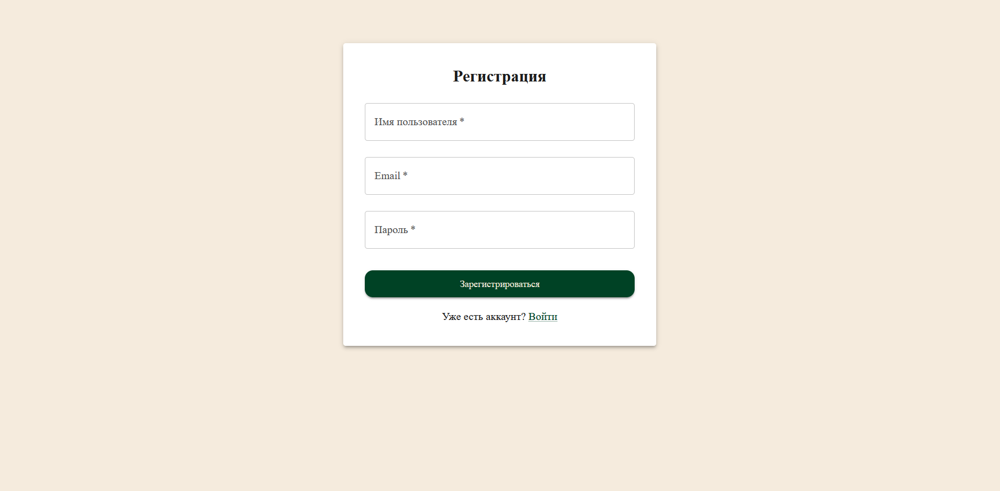

### 4.2 Аутентификация
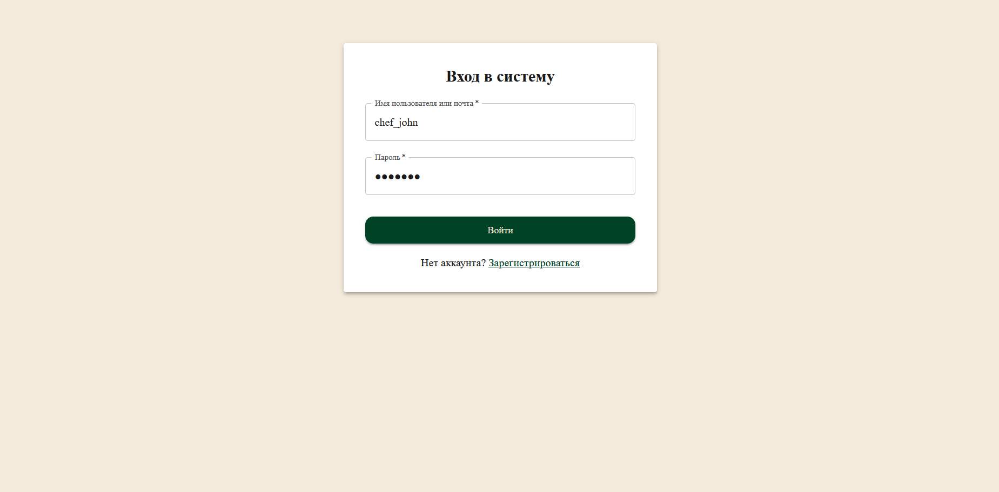

### 4.3 Главный экран админа
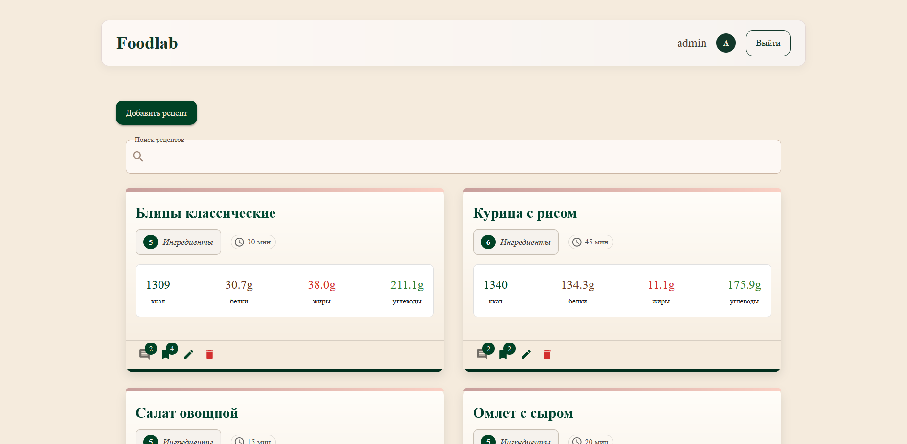

### 4.4 Главный экран пользователя
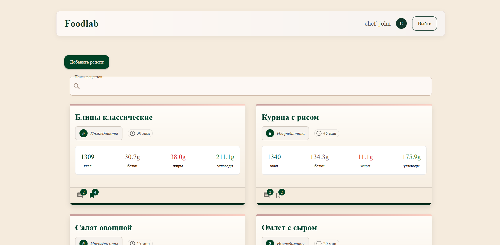

### 4.5 Главный экран гостя
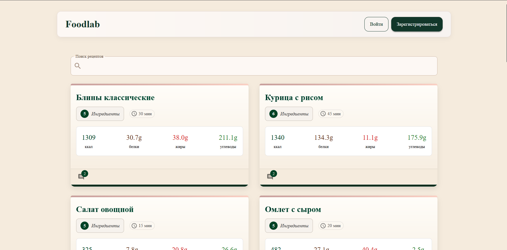

### 4.6 Поиск
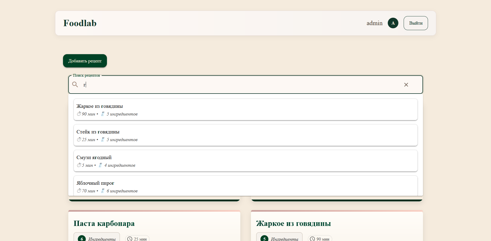

### 4.7 Комментарии
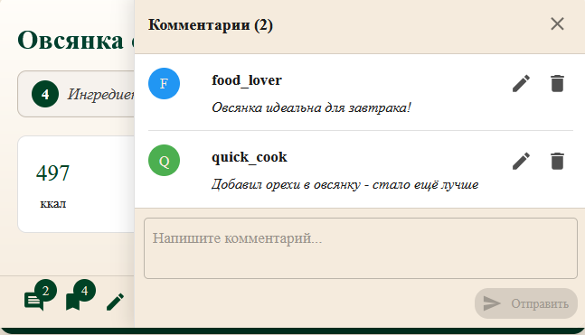

### 4.8 Список ингредиентов 
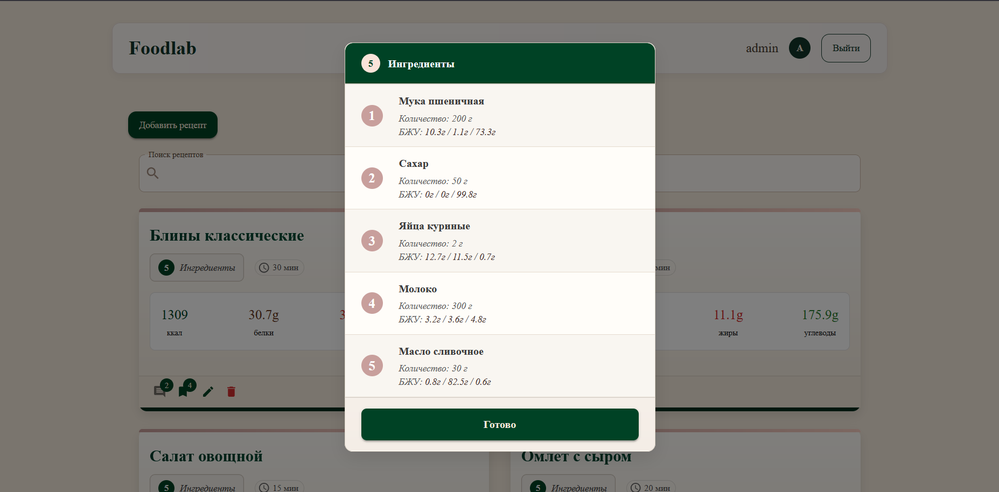

### 4.9 Добавдение рецепта
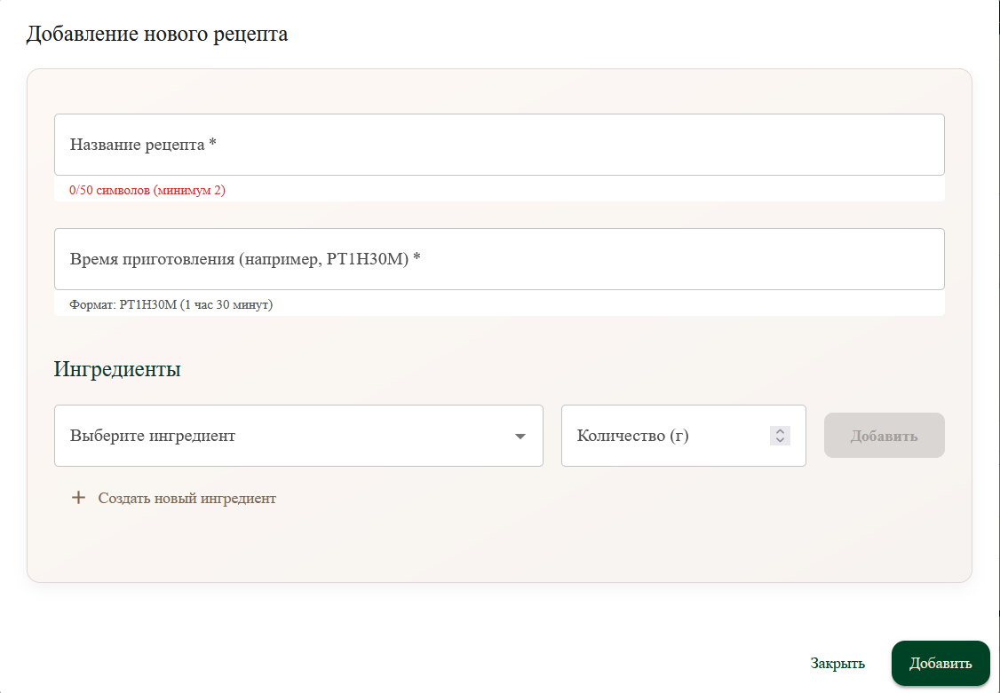

### 4.10 Добавдение ингредиента
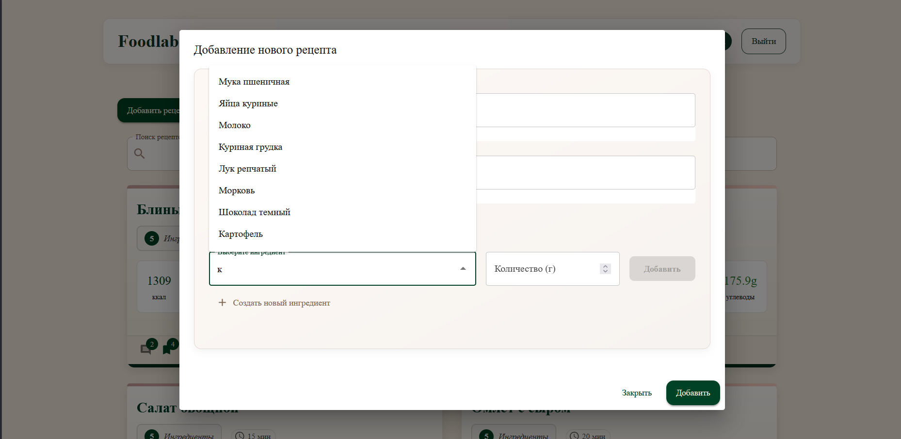

### 4.11 Редактирование рецепта
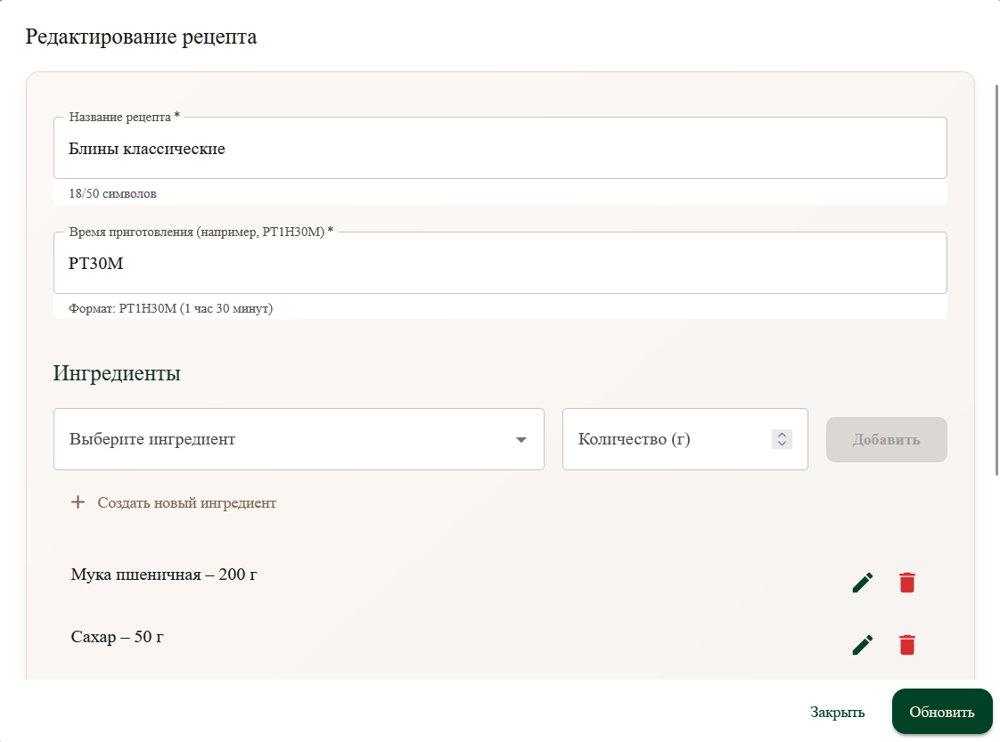

### 4.12 Добавдение нового ингредиента
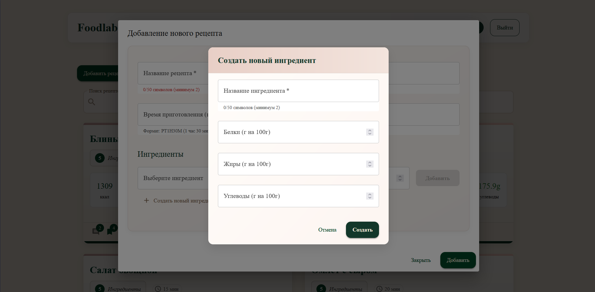

### 4.13 Удаление рецепта
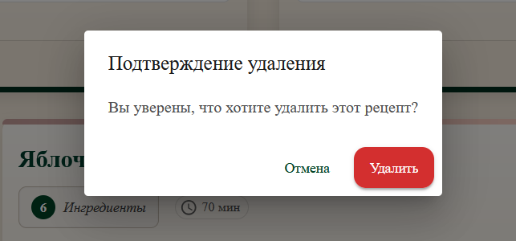

---

## 5. Технологический стек

| Компонент          | Технология |
|-------------------|------------|
| Backend Framework | Spring Boot 3.x |
| Database          | PostgreSQL 14+ |
| ORM               | Hibernate 6.x |
| Frontend          | React 18 |
| UI Framework      | Material-UI v5 |
| Build Tool        | Maven / npm |
| Authentication    | JWT |
| API Documentation | Swagger/OpenAPI 3 |
| Containerization  | Docker + Docker Compose |
| Testing           | JUnit 5, Mockito, React Testing Library |

---

## 6. Безопасность и производительность

- Валидация всех входных данных
- Ограничение скорости для API
- In-memory caching (Redis/Ehcache)
- Оптимизация запросов
- Поддержка логирования (SLF4J + Logback)

---

## 7. Тестирование

- Юнит-тесты для всех сервисов
- Интеграционные тесты для API
- Тестирование импорта/экспорта CSV
- Проверка валидности данных

---

## 8. Развёртывание

- Контейнеризация Docker
- Облачное развертывание (AWS/Azure/GCP)
- Конвейеры CI/CD (GitHub Actions/GitLab CI)

---

> **Примечание**: Данная спецификация может быть дополнена в процессе разработки проекта. Все изменения должны быть документированы и согласованы.
