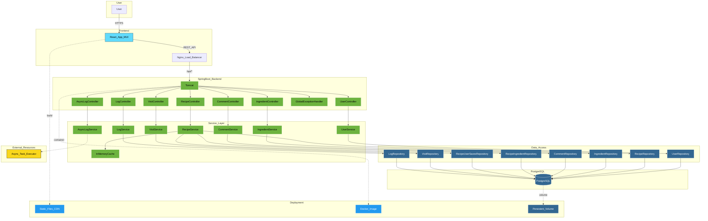

```mermaid
graph TB
    subgraph User
        U[User]
    end

    subgraph Frontend
        U -->|HTTPS| RA[React_App_MUI]
        RA -->|REST_API| GLB
    end

    GLB[Nginx_Load_Balancer]

    subgraph SpringBoot_Backend
        GLB -->|/api/*| SB[Tomcat]

        %% Controllers
        SB --> UC[UserController]
        SB --> RC[RecipeController]
        SB --> IC[IngredientController]
        SB --> CC[CommentController]
        SB --> LC[LogController]
        SB --> ALC[AsyncLogController]
        SB --> VC[VisitController]

        SB --> GEH[GlobalExceptionHandler]
    end

    subgraph Service_Layer
        UC --> US[UserService]
        RC --> RS[RecipeService]
        IC --> IS[IngredientService]
        CC --> CS[CommentService]
        LC --> LS[LogService]
        ALC --> ALS[AsyncLogService]
        VC --> VS[VisitService]

        %% Cache
        RS --> CACHE[InMemoryCache]
    end

    subgraph Data_Access
        US --> UR[UserRepository]
        RS --> RR[RecipeRepository]
        IS --> IR[IngredientRepository]
        CS --> CR[CommentRepository]
        RS --> RIR[RecipeIngredientRepository]
        RS --> SUR[RecipeUserSavesRepository]
        VS --> VR[VisitRepository]
        LS --> LR[LogRepository]
    end

    subgraph PostgreSQL
        UR --> DB[(PostgreSQL)]
        RR --> DB
        IR --> DB
        CR --> DB
        RIR --> DB
        SUR --> DB
        VR --> DB
        LR --> DB
    end

    subgraph External_Resources
        ALS -.-> EXEC[Async_Task_Executor]
    end

    subgraph Deployment
        RA -.->|build| STAT[Static_Files_CDN]
        SB -.->|container| DOCKER[Docker_Image]
        DB -.->|volume| VOL[Persistent_Volume]
    end

    %% ---- Class styles ----
    classDef frontend fill:#61dafb,stroke:#282c34,color:#000
    classDef backend fill:#6db33f,stroke:#fff,color:#000
    classDef db fill:#336791,stroke:#fff,color:#fff
    classDef external fill:#f9d71c,stroke:#000,color:#000
    classDef deployment fill:#239aef,stroke:#fff,color:#fff

    class RA frontend
    class SB,UC,RC,IC,CC,LC,ALC,VC,US,RS,IS,CS,LS,ALS,VS,CACHE,GEH backend
    class DB,UR,RR,IR,CR,RIR,SUR,VR,LR,VOL db
    class EXEC external
    class STAT,DOCKER deployment
```
