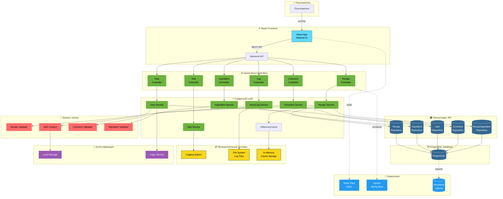

```mermaid
graph TB
    subgraph "👤 Пользователь"
        U[Пользователь]
    end

    %% ---------- Frontend ----------
    subgraph "🌐 React Frontend"
        U --> |HTTPS| RA[React App<br/>Material-UI]
        RA --> |REST API| API[Backend API]
    end

    %% ---------- Backend Controllers ----------
    subgraph "⚙️ Spring Boot Controllers"
        API --> RC[Recipe<br/>Controller]
        API --> IC[Ingredient<br/>Controller]
        API --> UC[User<br/>Controller]
        API --> CC[Comment<br/>Controller]
        API --> VC[Visit<br/>Controller]
        API --> LC[Log<br/>Controller]
    end

    %% ---------- Services ----------
    subgraph "🔧 Сервисный слой"
        RC --> RS[Recipe Service]
        IC --> IS[Ingredient Service]
        UC --> US[User Service]
        CC --> CS[Comment Service]
        VC --> VS[Visit Service]
        LC --> LS[AsyncLog Service]
        
        RS --> CACHE[InMemoryCache]
    end

    %% ---------- Repositories ----------
    subgraph "🗃️ Репозитории JPA"
        RS --> RR[(Recipe<br/>Repository)]
        IS --> IR[(Ingredient<br/>Repository)]
        US --> UR[(User<br/>Repository)]
        CS --> CR[(Comment<br/>Repository)]
        
        RS --> RIR[(RecipeIngredient<br/>Repository)]
    end

    %% ---------- База данных ----------
    subgraph "🗄️ PostgreSQL Database"
        RR --> DB[(PostgreSQL<br/>)]
        IR --> DB
        UR --> DB
        CR --> DB
        RIR --> DB
    end

    %% ---------- Бизнес-логика ----------
    subgraph "🎯 Бизнес-логика"
        RS --> VALID[Recipe Validator]
        US --> AUTH[Auth Context]
        CS --> CVALID[Comment Validator]
        IS --> IVALID[Ingredient Validator]
    end

    %% ---------- Вспомогательные компоненты ----------
    subgraph "📦 Вспомогательные системы"
        VS --> LOGGING[Logging Aspect]
        LS --> FILE[File System<br/>Log Files]
        CACHE --> MEM[In-Memory<br/>Cache Storage]
    end

    %% ---------- Security ----------
    subgraph "🔐 Аутентификация"
        AUTH --> LOCAL[Local Storage]
        US --> LOGIN[Login Service]
    end

    %% ---------- Deployment ----------
    subgraph "🐳 Deployment"
        RA -.-> |build| STAT[Static Files<br/>Nginx]
        RC -.-> |container| DOCK[Docker<br/>Spring Boot]
        DB -.-> |volume| VOL[(Persistent<br/>Volume)]
    end

    classDef frontend fill:#61dafb,stroke:#282c34,color:#000
    classDef backend fill:#6db33f,stroke:#fff,color:#000
    classDef db fill:#336791,stroke:#fff,color:#fff
    classDef business fill:#ff6b6b,stroke:#fff,color:#000
    classDef support fill:#f9d71c,stroke:#000,color:#000
    classDef security fill:#9b59b6,stroke:#fff,color:#fff
    classDef deployment fill:#239aef,stroke:#fff,color:#fff

    class RA frontend
    class RC,IC,UC,CC,VC,LC,RS,IS,US,CS,VS,LS backend
    class DB,RR,IR,UR,CR,RIR db
    class VALID,AUTH,CVALID,IVALID business
    class LOGGING,FILE,MEM support
    class LOCAL,LOGIN security
    class STAT,DOCK,VOL deployment
```
