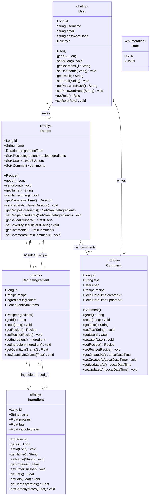

# 📊 Диаграмма классов

```mermaid
classDiagram
    class User {
        <<Entity>>
        +Long id
        +String username
        +String email
        +String passwordHash
        +Role role
        +User()
        +getId() Long
        +setId(Long) void
        +getUsername() String
        +setUsername(String) void
        +getEmail() String
        +setEmail(String) void
        +getPasswordHash() String
        +setPasswordHash(String) void
        +getRole() Role
        +setRole(Role) void
    }

    class Recipe {
        <<Entity>>
        +Long id
        +String name
        +Duration preparationTime
        +Set~RecipeIngredient~ recipeIngredients
        +Set~User~ savedByUsers
        +Set~Comment~ comments
        +Recipe()
        +getId() Long
        +setId(Long) void
        +getName() String
        +setName(String) void
        +getPreparationTime() Duration
        +setPreparationTime(Duration) void
        +getRecipeIngredients() Set~RecipeIngredient~
        +setRecipeIngredients(Set~RecipeIngredient~) void
        +getSavedByUsers() Set~User~
        +setSavedByUsers(Set~User~) void
        +getComments() Set~Comment~
        +setComments(Set~Comment~) void
    }

    class Ingredient {
        <<Entity>>
        +Long id
        +String name
        +Float proteins
        +Float fats
        +Float carbohydrates
        +Ingredient()
        +getId() Long
        +setId(Long) void
        +getName() String
        +setName(String) void
        +getProteins() Float
        +setProteins(Float) void
        +getFats() Float
        +setFats(Float) void
        +getCarbohydrates() Float
        +setCarbohydrates(Float) void
    }

    class RecipeIngredient {
        <<Entity>>
        +Long id
        +Recipe recipe
        +Ingredient ingredient
        +Float quantityInGrams
        +RecipeIngredient()
        +getId() Long
        +setId(Long) void
        +getRecipe() Recipe
        +setRecipe(Recipe) void
        +getIngredient() Ingredient
        +setIngredient(Ingredient) void
        +getQuantityInGrams() Float
        +setQuantityInGrams(Float) void
    }

    class Comment {
        <<Entity>>
        +Long id
        +String text
        +User user
        +Recipe recipe
        +LocalDateTime createdAt
        +LocalDateTime updatedAt
        +Comment()
        +getId() Long
        +setId(Long) void
        +getText() String
        +setText(String) void
        +getUser() User
        +setUser(User) void
        +getRecipe() Recipe
        +setRecipe(Recipe) void
        +getCreatedAt() LocalDateTime
        +setCreatedAt(LocalDateTime) void
        +getUpdatedAt() LocalDateTime
        +setUpdatedAt(LocalDateTime) void
    }

    class Role {
        <<enumeration>>
        USER
        ADMIN
    }

    %% ---- Associations ----
    Recipe "1" *-- "0..*" RecipeIngredient : includes
    RecipeIngredient "1" --> "1" Ingredient : ingredient
    RecipeIngredient "1" --> "1" Recipe : recipe

    Recipe "1" o-- "0..*" Comment : has_comments
    User "1" o-- "0..*" Comment : writes

    User "0..*" -- "0..*" Recipe : saves
    Ingredient "1" o-- "0..*" RecipeIngredient : used_in
```
