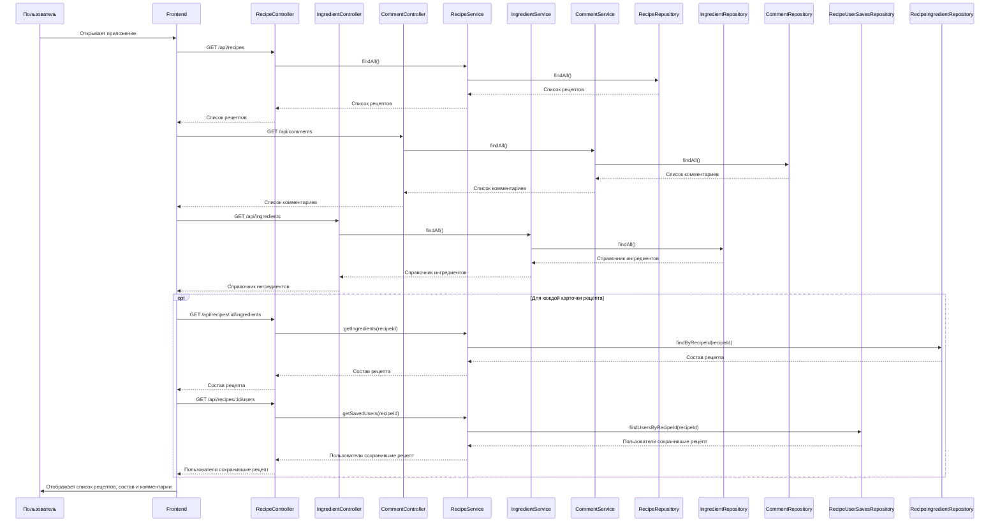
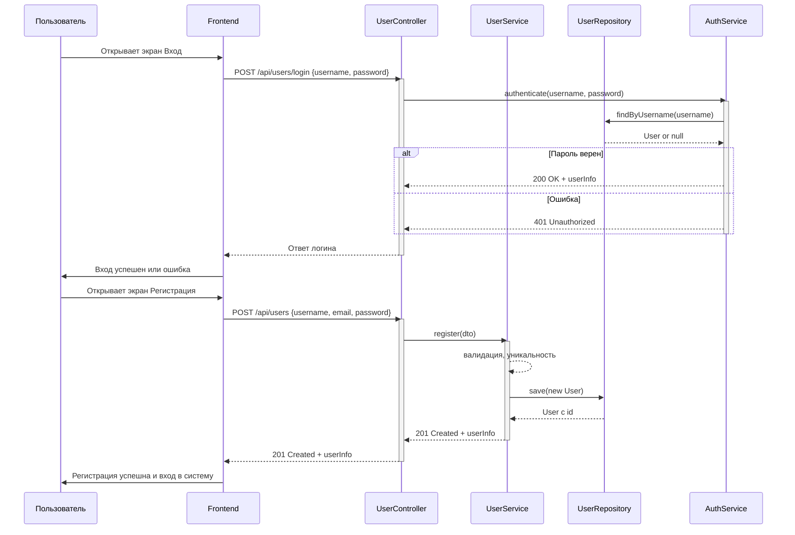
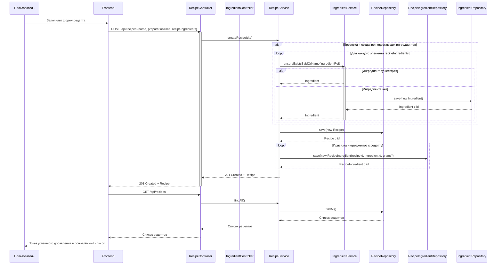

# 📊 Диаграммы последовательностей

### 1. Загрузка данных

```mermaid
sequenceDiagram
    participant User as Пользователь
    participant Frontend as Frontend
    participant Recipes as RecipeController
    participant Ingredients as IngredientController
    participant Comments as CommentController
    participant RecipeService as RecipeService
    participant IngredientService as IngredientService
    participant CommentService as CommentService
    participant RecipeRepo as RecipeRepository
    participant IngredientRepo as IngredientRepository
    participant CommentRepo as CommentRepository
    participant SavesRepo as RecipeUserSavesRepository
    participant RecipeIngrRepo as RecipeIngredientRepository

    User->>Frontend: Открывает приложение
    Frontend->>Recipes: GET /api/recipes
    Recipes->>RecipeService: findAll()
    RecipeService->>RecipeRepo: findAll()
    RecipeRepo-->>RecipeService: Список рецептов
    RecipeService-->>Recipes: Список рецептов
    Recipes-->>Frontend: Список рецептов

    Frontend->>Comments: GET /api/comments
    Comments->>CommentService: findAll()
    CommentService->>CommentRepo: findAll()
    CommentRepo-->>CommentService: Список комментариев
    CommentService-->>Comments: Список комментариев
    Comments-->>Frontend: Список комментариев

    Frontend->>Ingredients: GET /api/ingredients
    Ingredients->>IngredientService: findAll()
    IngredientService->>IngredientRepo: findAll()
    IngredientRepo-->>IngredientService: Справочник ингредиентов
    IngredientService-->>Ingredients: Справочник ингредиентов
    Ingredients-->>Frontend: Справочник ингредиентов

    opt Для каждой карточки рецепта
        Frontend->>Recipes: GET /api/recipes/:id/ingredients
        Recipes->>RecipeService: getIngredients(recipeId)
        RecipeService->>RecipeIngrRepo: findByRecipeId(recipeId)
        RecipeIngrRepo-->>RecipeService: Состав рецепта
        RecipeService-->>Recipes: Состав рецепта
        Recipes-->>Frontend: Состав рецепта

        Frontend->>Recipes: GET /api/recipes/:id/users
        Recipes->>RecipeService: getSavedUsers(recipeId)
        RecipeService->>SavesRepo: findUsersByRecipeId(recipeId)
        SavesRepo-->>RecipeService: Пользователи сохранившие рецепт
        RecipeService-->>Recipes: Пользователи сохранившие рецепт
        Recipes-->>Frontend: Пользователи сохранившие рецепт
    end

    Frontend->>User: Отображает список рецептов, состав и комментарии
```

### 2. Авторизация и регистрация

```mermaid
sequenceDiagram
    participant User as Пользователь
    participant Frontend as Frontend
    participant Users as UserController
    participant UserService as UserService
    participant UserRepo as UserRepository
    participant Auth as AuthService

    User->>Frontend: Открывает экран Вход
    Frontend->>Users: POST /api/users/login {username, password}
    activate Users
    Users->>Auth: authenticate(username, password)
    activate Auth
    Auth->>UserRepo: findByUsername(username)
    UserRepo-->>Auth: User or null
    alt Пароль верен
        Auth-->>Users: 200 OK + userInfo
    else Ошибка
        Auth-->>Users: 401 Unauthorized
    end
    deactivate Auth
    Users-->>Frontend: Ответ логина
    deactivate Users
    Frontend->>User: Вход успешен или ошибка

    User->>Frontend: Открывает экран Регистрация
    Frontend->>Users: POST /api/users {username, email, password}
    activate Users
    Users->>UserService: register(dto)
    activate UserService
    UserService-->>UserService: валидация, уникальность
    UserService->>UserRepo: save(new User)
    UserRepo-->>UserService: User c id
    UserService-->>Users: 201 Created + userInfo
    deactivate UserService
    Users-->>Frontend: 201 Created + userInfo
    deactivate Users
    Frontend->>User: Регистрация успешна и вход в систему
```

### 3. Добавление рецепта

```mermaid
sequenceDiagram
    participant User as Пользователь
    participant Frontend as Frontend
    participant Recipes as RecipeController
    participant Ingredients as IngredientController
    participant RecipeService as RecipeService
    participant IngredientService as IngredientService
    participant RecipeRepo as RecipeRepository
    participant RecipeIngrRepo as RecipeIngredientRepository
    participant IngredientRepo as IngredientRepository

    User->>Frontend: Заполняет форму рецепта
    Frontend->>Recipes: POST /api/recipes {name, preparationTime, recipeIngredients}
    activate Recipes

    Recipes->>RecipeService: createRecipe(dto)
    activate RecipeService

    alt Проверка и создание недостающих ингредиентов
        loop Для каждого элемента recipeIngredients
            RecipeService->>IngredientService: ensureExistsByIdOrName(ingredientRef)
            activate IngredientService
            alt Ингредиент существует
                IngredientService-->>RecipeService: Ingredient
            else Ингредиента нет
                IngredientService->>IngredientRepo: save(new Ingredient)
                IngredientRepo-->>IngredientService: Ingredient c id
                IngredientService-->>RecipeService: Ingredient
            end
            deactivate IngredientService
        end
    end

    RecipeService->>RecipeRepo: save(new Recipe)
    RecipeRepo-->>RecipeService: Recipe c id

    loop Привязка ингредиентов к рецепту
        RecipeService->>RecipeIngrRepo: save(new RecipeIngredient(recipeId, ingredientId, grams))
        RecipeIngrRepo-->>RecipeService: RecipeIngredient c id
    end

    RecipeService-->>Recipes: 201 Created + Recipe
    deactivate RecipeService

    Recipes-->>Frontend: 201 Created + Recipe
    deactivate Recipes

    Frontend->>Recipes: GET /api/recipes
    Recipes->>RecipeService: findAll()
    RecipeService->>RecipeRepo: findAll()
    RecipeRepo-->>RecipeService: Список рецептов
    RecipeService-->>Recipes: Список рецептов
    Recipes-->>Frontend: Список рецептов

    Frontend->>User: Показ успешного добавления и обновлённый список
```
