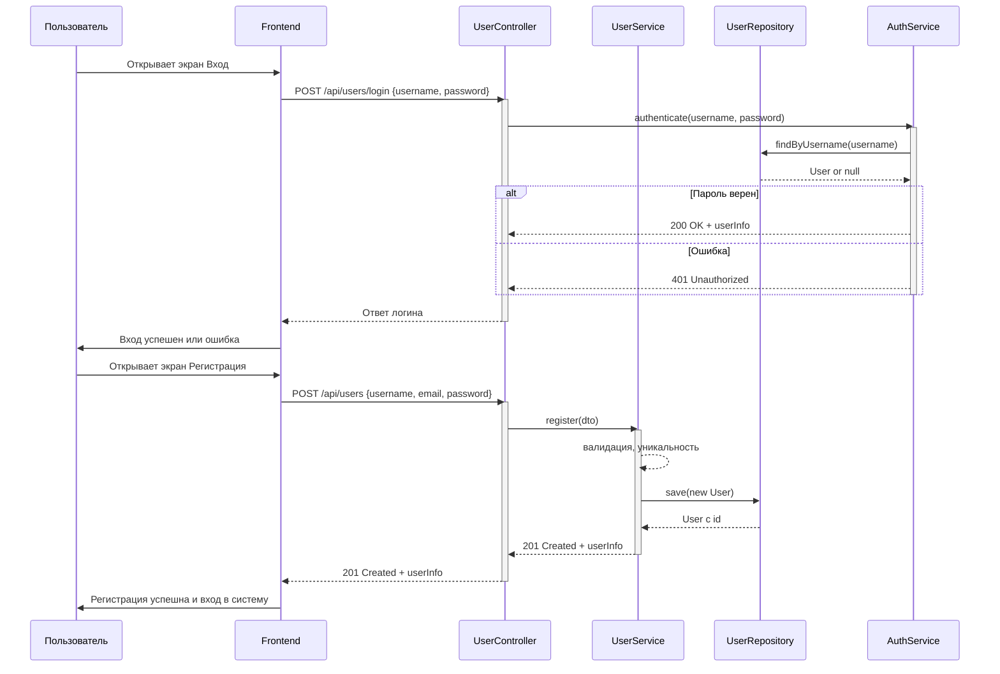
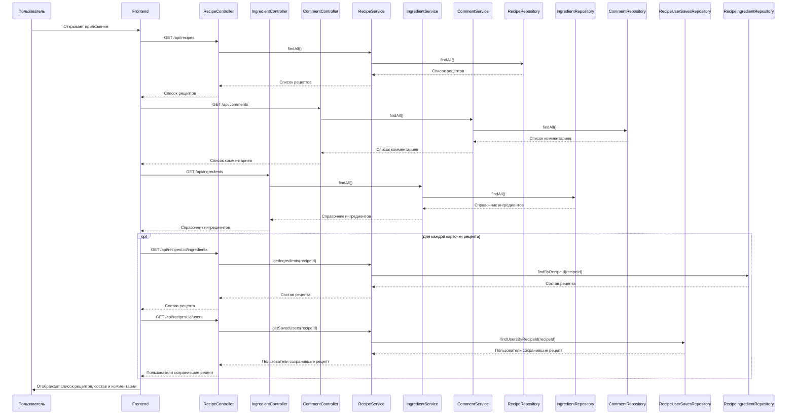
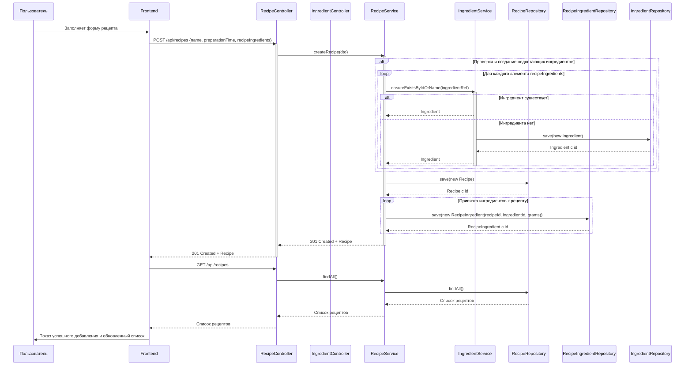
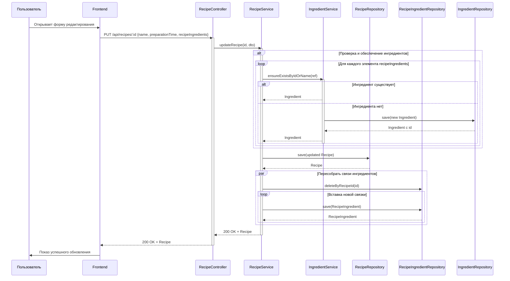
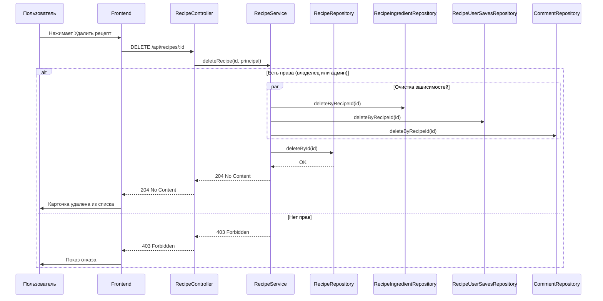
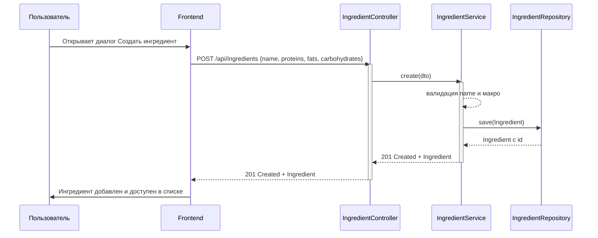
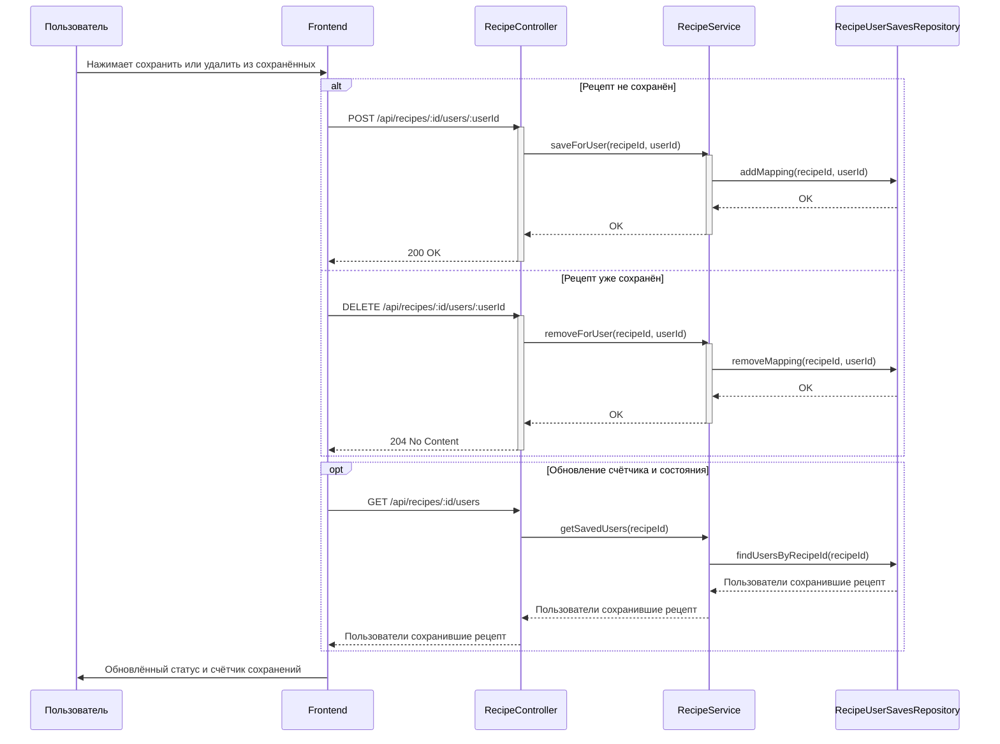
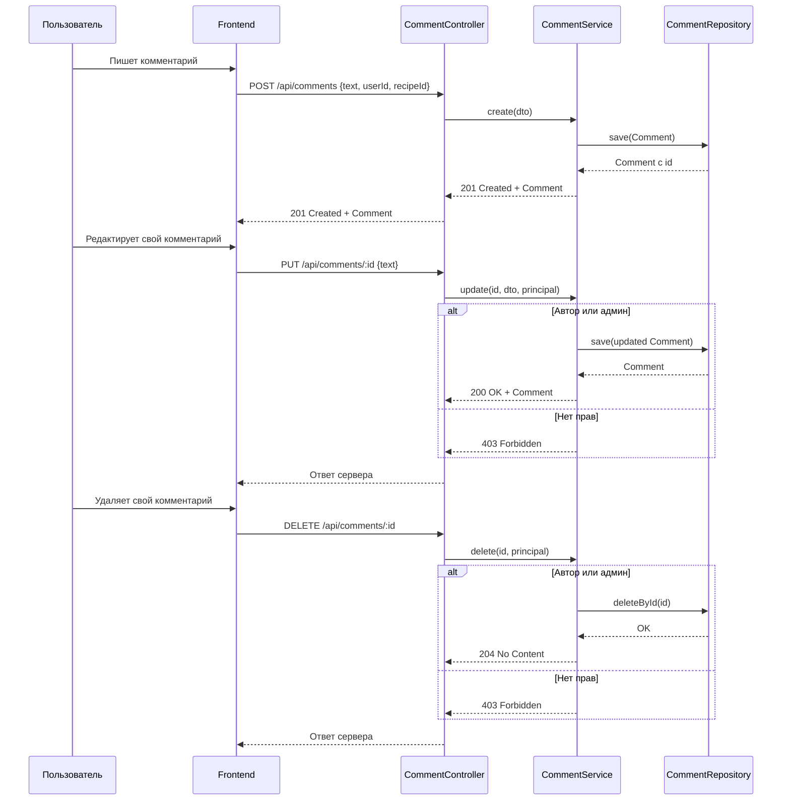

# 📊 Диаграммы последовательностей

### 1. Авторизация и регистрация

### 2. Загрузка данных

### 3. Добавление рецепта

### 4. Редактирование рецепта

### 5. Удаление рецепта

### 6. Создание ингредиента

### 7. Сохранение или удаление рецепта из избранного

### 8. Комментирование

