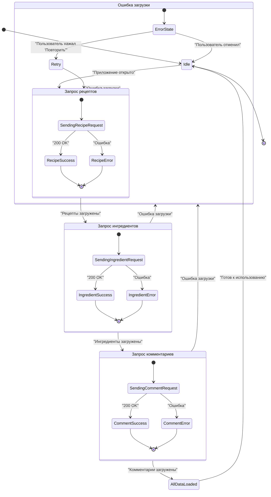
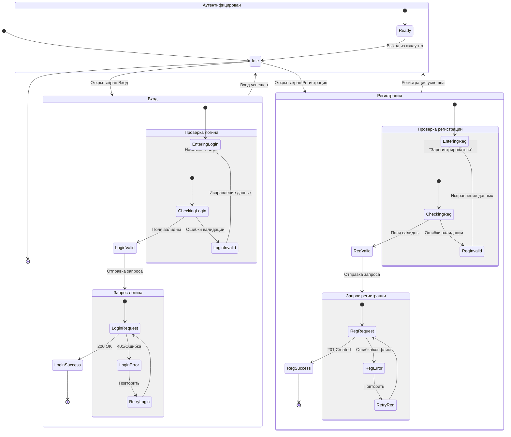
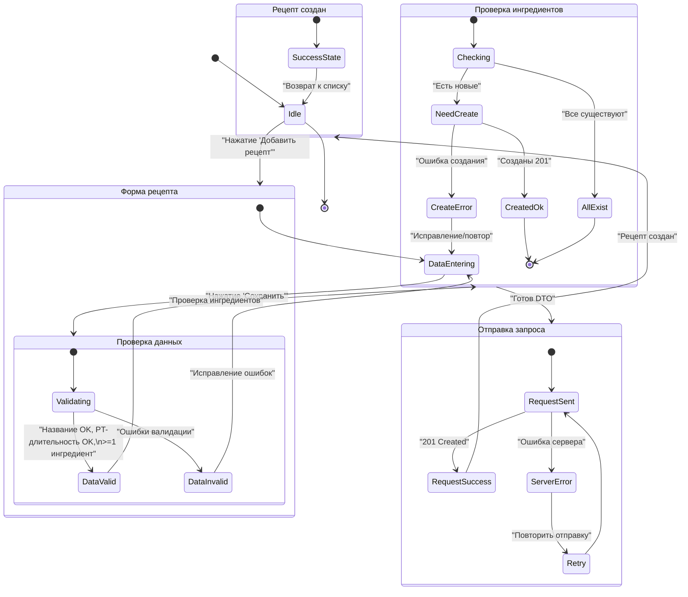

# 📊 Диаграммы состояний

### 1. Загрузка данных

```mermaid
stateDiagram-v2
    [*] --> Idle
    Idle --> RequestRecipes : "Приложение открыто"

    state "Запрос рецептов" as RequestRecipes {
        [*] --> SendingRecipeRequest
        SendingRecipeRequest --> RecipeSuccess : "200 OK"
        SendingRecipeRequest --> RecipeError : "Ошибка"
        RecipeSuccess --> [*]
        RecipeError --> [*]
    }

    RequestRecipes --> RequestIngredients : "Рецепты загружены"
    RequestRecipes --> LoadError : "Ошибка загрузки"

    state "Запрос ингредиентов" as RequestIngredients {
        [*] --> SendingIngredientRequest
        SendingIngredientRequest --> IngredientSuccess : "200 OK"
        SendingIngredientRequest --> IngredientError : "Ошибка"
        IngredientSuccess --> [*]
        IngredientError --> [*]
    }

    RequestIngredients --> RequestComments : "Ингредиенты загружены"
    RequestIngredients --> LoadError : "Ошибка загрузки"

    state "Запрос комментариев" as RequestComments {
        [*] --> SendingCommentRequest
        SendingCommentRequest --> CommentSuccess : "200 OK"
        SendingCommentRequest --> CommentError : "Ошибка"
        CommentSuccess --> [*]
        CommentError --> [*]
    }

    RequestComments --> AllDataLoaded : "Комментарии загружены"
    RequestComments --> LoadError : "Ошибка загрузки"

    state "Ошибка загрузки" as LoadError {
        [*] --> ErrorState
        ErrorState --> Retry : "Пользователь нажал 'Повторить'"
        Retry --> RequestRecipes
        ErrorState --> Idle : "Пользователь отменил"
    }

    AllDataLoaded --> Idle : "Готов к использованию"
    Idle --> [*]
```

### 2. Авторизация/регистрация

```mermaid
stateDiagram-v2
    [*] --> Idle

    Idle --> LoginView : Открыт экран Вход
    Idle --> RegisterView : Открыт экран Регистрация

    state "Вход" as LoginView {
        [*] --> EnteringLogin
        EnteringLogin --> ValidateLogin : Нажатие "Войти"

        state "Проверка логина" as ValidateLogin {
            [*] --> CheckingLogin
            CheckingLogin --> LoginValid : Поля валидны
            CheckingLogin --> LoginInvalid : Ошибки валидации
            LoginInvalid --> EnteringLogin : Исправление данных
        }

        LoginValid --> SendingLogin : Отправка запроса

        state "Запрос логина" as SendingLogin {
            [*] --> LoginRequest
            LoginRequest --> LoginSuccess : 200 OK
            LoginRequest --> LoginError : 401/Ошибка
            LoginError --> RetryLogin : Повторить
            RetryLogin --> LoginRequest
        }

        LoginSuccess --> [*]
    }

    state "Регистрация" as RegisterView {
        [*] --> EnteringReg
        EnteringReg --> ValidateReg : Нажатие "Зарегистрироваться"

        state "Проверка регистрации" as ValidateReg {
            [*] --> CheckingReg
            CheckingReg --> RegValid : Поля валидны
            CheckingReg --> RegInvalid : Ошибки валидации
            RegInvalid --> EnteringReg : Исправление данных
        }

        RegValid --> SendingReg : Отправка запроса

        state "Запрос регистрации" as SendingReg {
            [*] --> RegRequest
            RegRequest --> RegSuccess : 201 Created
            RegRequest --> RegError : Ошибка/конфликт
            RegError --> RetryReg : Повторить
            RetryReg --> RegRequest
        }

        RegSuccess --> [*]
    }

    LoginView --> Authenticated : Вход успешен
    RegisterView --> Authenticated : Регистрация успешна

    state "Аутентифицирован" as Authenticated {
        [*] --> Ready
        Ready --> Idle : Выход из аккаунта
    }

    Idle --> [*]
```

### 3. Добавление рецепта

```mermaid
stateDiagram-v2
    [*] --> Idle
    Idle --> FormOpened : "Нажатие 'Добавить рецепт'"

    state "Форма рецепта" as FormOpened {
        [*] --> DataEntering
        DataEntering --> DataValidation : "Нажатие 'Сохранить'"
    }

    state "Проверка данных" as DataValidation {
        [*] --> Validating
        Validating --> DataValid : "Название OK, PT-длительность OK,\n>=1 ингредиент"
        Validating --> DataInvalid : "Ошибки валидации"
        DataInvalid --> DataEntering : "Исправление ошибок"
    }

    DataValid --> EnsureIngredients : "Проверка ингредиентов"

    state "Проверка ингредиентов" as EnsureIngredients {
        [*] --> Checking
        Checking --> AllExist : "Все существуют"
        Checking --> NeedCreate : "Есть новые"
        NeedCreate --> CreatedOk : "Созданы 201"
        NeedCreate --> CreateError : "Ошибка создания"
        CreatedOk --> [*]
        CreateError --> DataEntering : "Исправление/повтор"
        AllExist --> [*]
    }

    EnsureIngredients --> SendingRequest : "Готов DTO"

    state "Отправка запроса" as SendingRequest {
        [*] --> RequestSent
        RequestSent --> RequestSuccess : "201 Created"
        RequestSent --> ServerError : "Ошибка сервера"
        ServerError --> Retry : "Повторить отправку"
        Retry --> RequestSent
    }

    RequestSuccess --> RecipeCreated : "Рецепт создан"

    state "Рецепт создан" as RecipeCreated {
        [*] --> SuccessState
        SuccessState --> Idle : "Возврат к списку"
    }

    Idle --> [*]
```
