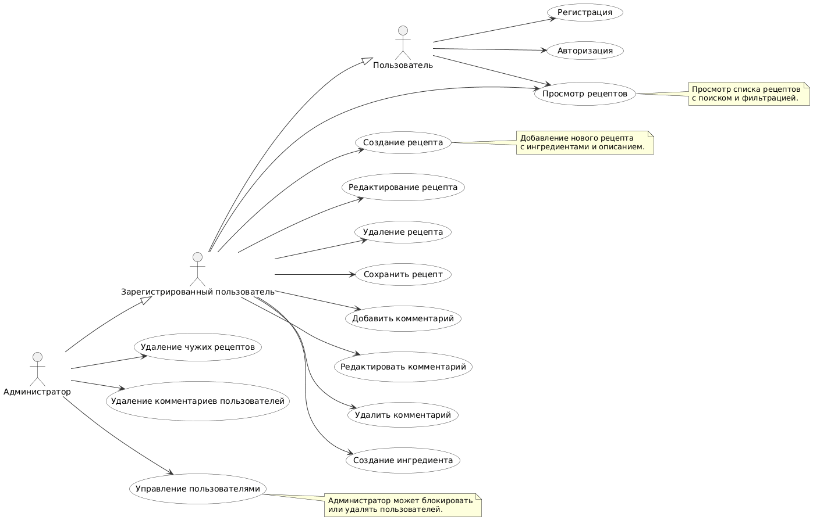

# 📊 Диаграмма вариантов использования

# Глоссарий

| Термин | Определение |
|:--|:--|
| Пользователь | Неавторизованный человек, который может просматривать рецепты |
| Зарегистрированный пользователь | Пользователь, вошедший в систему и имеющий доступ к функциям создания и редактирования контента |
| Администратор | Пользователь с расширенными правами, может управлять другими пользователями и контентом |
| Рецепт | Основная сущность, содержащая список ингредиентов, шаги приготовления и описание |
| Ингредиент | Составная часть рецепта с названием и количеством |
| Комментарий | Текстовая запись, оставляемая под рецептом |
| Избранное | Коллекция рецептов, сохранённых пользователем для быстрого доступа |

# Поток событий

# Содержание
1 [Актёры](#actors)  
2 [Варианты использования](#use_cases)  
2.1 [Просмотр рецептов](#view_recipes)  
2.2 [Создание рецепта](#create_recipe)  
2.3 [Редактирование рецепта](#edit_recipe)  
2.4 [Удаление рецепта](#delete_recipe)  
2.5 [Сохранение рецепта в избранное](#save_recipe)  
2.6 [Добавление комментария](#add_comment)  
2.7 [Авторизация](#login)  
2.8 [Регистрация](#register)  
2.9 [Управление пользователями (админ)](#admin_manage_users)  

---

# 1 Актёры

| Актёр | Описание |
|:--|:--|
| Пользователь | Неавторизованный посетитель, который может просматривать рецепты и зарегистрироваться |
| Зарегистрированный пользователь | Авторизованный пользователь, который может добавлять, редактировать и комментировать рецепты |
| Администратор | Пользователь с правами модератора, который может удалять рецепты, комментарии и пользователей |

---

# 2 Варианты использования

---

## 2.1 Просмотр рецептов

**Описание.** Позволяет пользователю просматривать список рецептов и фильтровать их по категориям или названию.  
**Предусловия.** Система загружена и доступна.  
**Основной поток.**
1. Пользователь открывает главную страницу Foodlab;  
2. Система отправляет запрос на получение списка рецептов;  
3. Сервер возвращает данные;  
4. Система отображает рецепты в виде карточек;  
5. Пользователь может выбрать рецепт для детального просмотра;  
6. Вариант использования завершается.  

---

## 2.2 Создание рецепта

**Описание.** Позволяет зарегистрированному пользователю добавить новый рецепт с ингредиентами и инструкциями.  
**Предусловия.** Пользователь авторизован и находится в личном кабинете.  
**Основной поток.**
1. Пользователь нажимает кнопку "Добавить рецепт";  
2. Система открывает форму создания;  
3. Пользователь вводит название, описание, шаги и добавляет ингредиенты;  
4. Система проверяет корректность данных;  
5. Система сохраняет рецепт в базе данных;  
6. Отображается уведомление об успешном создании;  
7. Вариант использования завершается.  

**Альтернативный поток А1.**  
1. Введены невалидные данные (например, отсутствует название);  
2. Система отображает сообщение об ошибке;  
3. Пользователь исправляет данные и повторяет отправку.  

---

## 2.3 Редактирование рецепта

**Описание.** Позволяет пользователю изменить данные существующего рецепта.  
**Предусловия.** Пользователь является автором рецепта или администратором.  
**Основной поток.**
1. Пользователь открывает страницу рецепта;  
2. Нажимает кнопку "Редактировать";  
3. Система отображает форму с текущими данными;  
4. Пользователь вносит изменения;  
5. Система проверяет валидность данных;  
6. Обновлённые данные сохраняются на сервере;  
7. Отображается сообщение об успешном обновлении;  
8. Вариант использования завершается.  

---

## 2.4 Удаление рецепта

**Описание.** Позволяет пользователю удалить собственный рецепт или администратору — любой.  
**Предусловия.** Пользователь авторизован и имеет права на удаление.  
**Основной поток.**
1. Пользователь нажимает кнопку "Удалить рецепт";  
2. Система запрашивает подтверждение;  
3. Пользователь подтверждает действие;  
4. Система удаляет рецепт из базы данных;  
5. Список рецептов обновляется;  
6. Вариант использования завершается.  

**Альтернативный поток А1.**  
1. Пользователь отменяет удаление;  
2. Система возвращает пользователя к просмотру рецепта.  

---

## 2.5 Сохранение рецепта в избранное

**Описание.** Позволяет пользователю добавить понравившийся рецепт в список сохранённых.  
**Предусловия.** Пользователь авторизован.  
**Основной поток.**
1. Пользователь нажимает на иконку "Сохранить";  
2. Система отправляет запрос на сервер;  
3. Сервер добавляет запись в таблицу избранных рецептов;  
4. Иконка изменяет состояние на "Сохранено";  
5. Вариант использования завершается.  

---

## 2.6 Добавление комментария

**Описание.** Позволяет пользователю оставить комментарий под рецептом.  
**Предусловия.** Пользователь авторизован и выбран рецепт.  
**Основной поток.**
1. Пользователь вводит текст комментария в поле;  
2. Система проверяет корректность текста;  
3. Отправляет запрос на сервер;  
4. Комментарий сохраняется и отображается под рецептом;  
5. Вариант использования завершается.  

---

## 2.7 Авторизация

**Описание.** Позволяет пользователю войти в систему, указав email и пароль.  
**Предусловия.** Пользователь зарегистрирован.  
**Основной поток.**
1. Пользователь открывает страницу авторизации;  
2. Вводит email и пароль;  
3. Система проверяет корректность данных;  
4. Сервер возвращает токен авторизации;  
5. Пользователь перенаправляется на главную страницу.  

**Альтернативный поток А1.**  
1. Введены неверные данные;  
2. Система отображает сообщение «Неверный логин или пароль»;  
3. Пользователь повторяет ввод.  

---

## 2.8 Регистрация

**Описание.** Позволяет новому пользователю создать учётную запись.  
**Предусловия.** Пользователь находится на странице регистрации.  
**Основной поток.**
1. Пользователь заполняет форму регистрации (имя, email, пароль);  
2. Система проверяет корректность данных;  
3. Сервер создаёт новую запись пользователя;  
4. Система перенаправляет на страницу авторизации.  

**Альтернативный поток А1.**  
1. Указанный email уже зарегистрирован;  
2. Система уведомляет пользователя;  
3. Пользователь вводит другой адрес или отменяет операцию.  

---

## 2.9 Управление пользователями (администратор)

**Описание.** Позволяет администратору управлять пользователями системы (просмотр, блокировка, удаление).  
**Предусловия.** Пользователь вошёл как администратор.  
**Основной поток.**
1. Администратор открывает панель управления пользователями;  
2. Система отображает список зарегистрированных пользователей;  
3. Администратор выбирает пользователя;  
4. Может изменить роль, заблокировать или удалить;  
5. Система применяет изменения;  
6. Вариант использования завершается.  

---

🟢 **Итого:**  
Этот документ описывает основные сценарии взаимодействия пользователей с системой **Foodlab**, включая CRUD-функционал рецептов, комментарии, избранное и административные действия.  
Все варианты использования связаны с диаграммой `use_cases_diagram.png`, расположенной в каталоге `/docs/diagrams/images/`.
